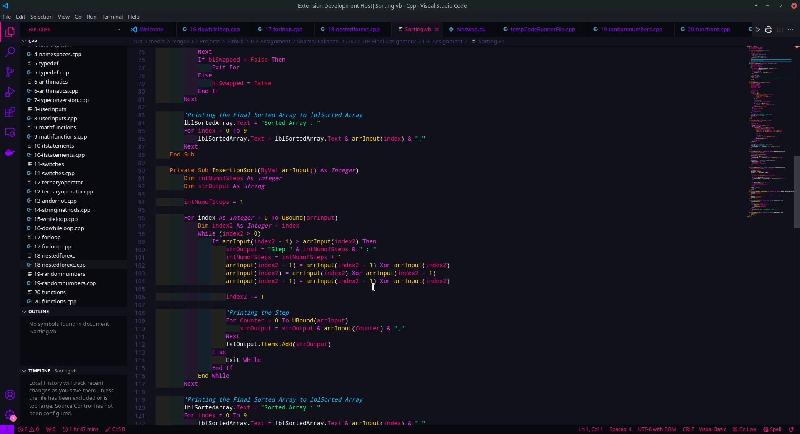
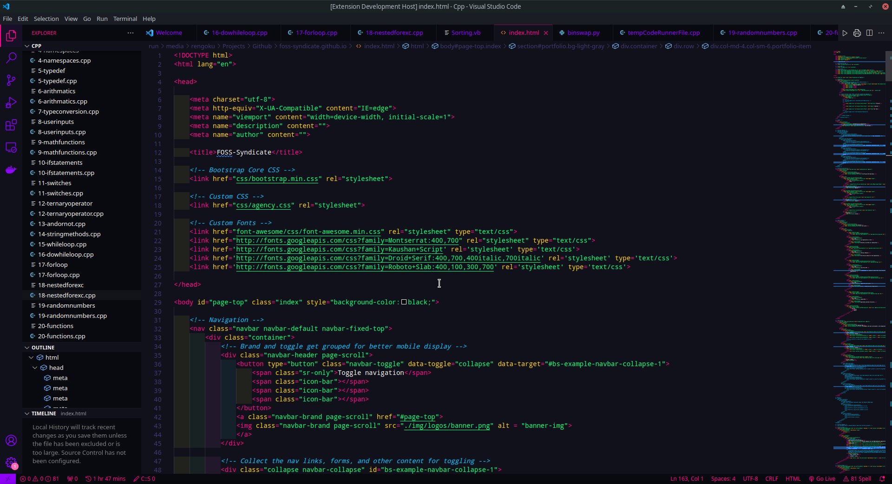
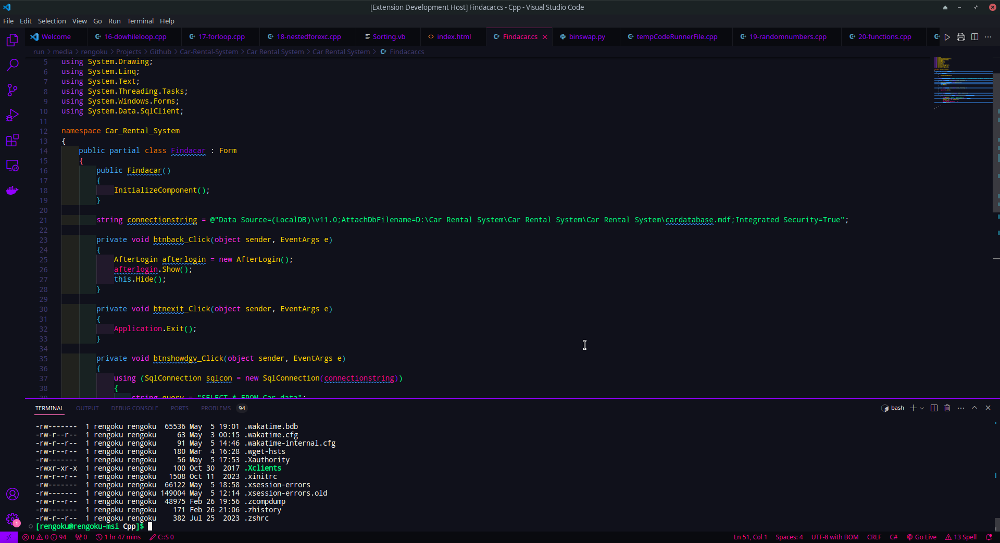

# VS-Code

## Preview

## Installation

- Search for 'Blossom Theme' in Vs Code extensions and install

OR

- visit : https://marketplace.visualstudio.com/items?itemName=BlossomTheme.blossomtheme
